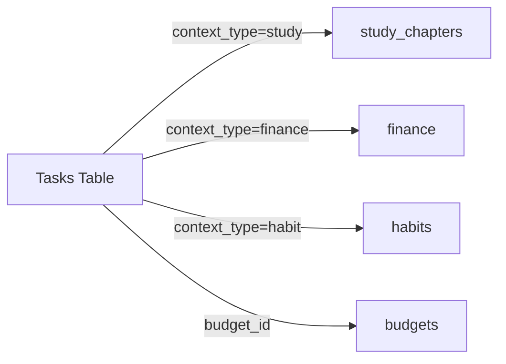

# Database Schema

## Overview
Database schemas are organized in `src/Database/` with separate files for each domain.

## Structure
```
src/Database/
├── client.ts          # Turso client & generateId()
├── index.ts           # Main entry point
└── schemas/
    ├── index.ts       # Schema exports
    ├── users.ts       # users & settings tables
    ├── tasks.ts       # tasks, task_labels, task_time_logs, task_templates tables
    ├── finance.ts     # finance table
    ├── notes.ts       # notes table
    ├── habits.ts      # habits table
    ├── inventory.ts   # inventory table
    ├── study.ts       # study_chapters table
    └── budget.ts      # budgets & savings_transactions tables
```

## Usage
```typescript
// Import client and helpers
import { db, generateId, initDatabase } from "@/Database";

// Or from legacy path (backwards compatible)
import { db, generateId, initDatabase } from "@/lib/turso";
```

## Tables

### users
| Column | Type | Description |
|--------|------|-------------|
| id | TEXT | Primary key |
| name | TEXT | User's name |
| email | TEXT | Unique email |
| password_hash | TEXT | Hashed password |
| preferences | TEXT | JSON preferences |
| created_at | TEXT | Timestamp |

### settings
| Column | Type | Description |
|--------|------|-------------|
| id | TEXT | Primary key |
| user_id | TEXT | Foreign key to users |
| theme | TEXT | 'light' or 'dark' |
| currency | TEXT | Currency code |
| language | TEXT | Language code |
| notifications_enabled | INTEGER | Boolean |
| monthly_budget | REAL | Budget amount |

### tasks (Central Hub)
| Column | Type | Description |
|--------|------|-------------|
| id | TEXT | Primary key |
| user_id | TEXT | Foreign key |
| title | TEXT | Task title |
| description | TEXT | Optional markdown description |
| status | TEXT | todo/in-progress/done |
| priority | TEXT | low/medium/high/urgent |
| due_date | TEXT | Optional due date |
| created_at | TEXT | Timestamp |
| completed_at | TEXT | Completion timestamp |
| context_type | TEXT | general/study/finance/habit/project |
| context_id | TEXT | Linked item ID (chapter/budget/habit) |
| budget_id | TEXT | Linked budget for cost tracking |
| expected_cost | REAL | Planned expense/income amount |
| finance_type | TEXT | 'income' or 'expense' - used when completing finance-linked tasks |
| start_time | TEXT | Scheduled start time |
| end_time | TEXT | Scheduled end time |
| estimated_duration | INTEGER | Estimated minutes |
| actual_duration | INTEGER | Actual minutes spent |
| recurrence_rule | TEXT | RRULE for recurring tasks |
| parent_task_id | TEXT | For subtasks |
| order_index | INTEGER | Manual sort order |
| labels | TEXT | Comma-separated labels |
| reminder_time | TEXT | Reminder timestamp |
| is_pinned | INTEGER | Pinned to top (0/1) |

### task_labels
| Column | Type | Description |
|--------|------|-------------|
| id | TEXT | Primary key |
| user_id | TEXT | Foreign key |
| name | TEXT | Label name |
| color | TEXT | Hex color code |

### task_time_logs
| Column | Type | Description |
|--------|------|-------------|
| id | TEXT | Primary key |
| task_id | TEXT | Foreign key to tasks |
| user_id | TEXT | Foreign key |
| start_time | TEXT | Timer start |
| end_time | TEXT | Timer end |
| notes | TEXT | Optional session notes |
| created_at | TEXT | Timestamp |

### task_templates
| Column | Type | Description |
|--------|------|-------------|
| id | TEXT | Primary key |
| user_id | TEXT | Foreign key |
| template_name | TEXT | Template name |
| title | TEXT | Default title |
| description | TEXT | Default description |
| priority | TEXT | Default priority |
| context_type | TEXT | Default context |
| estimated_duration | INTEGER | Default duration |
| labels | TEXT | Default labels |
| is_system | INTEGER | System template (0/1) |
| created_at | TEXT | Timestamp |

### finance
| Column | Type | Description |
|--------|------|-------------|
| id | TEXT | Primary key |
| user_id | TEXT | Foreign key |
| type | TEXT | income/expense |
| amount | REAL | Amount |
| category | TEXT | Category name |
| description | TEXT | Optional description |
| date | TEXT | Timestamp |
| is_special | INTEGER | Special item flag (0/1) |

### notes
| Column | Type | Description |
|--------|------|-------------|
| id | TEXT | Primary key |
| user_id | TEXT | Foreign key |
| title | TEXT | Note title |
| content | TEXT | Note content |
| tags | TEXT | Comma-separated tags |
| created_at | TEXT | Timestamp |

### habits
| Column | Type | Description |
|--------|------|-------------|
| id | TEXT | Primary key |
| user_id | TEXT | Foreign key |
| habit_name | TEXT | Habit name |
| streak_count | INTEGER | Current streak |
| last_completed_date | TEXT | Last completion |

### inventory
| Column | Type | Description |
|--------|------|-------------|
| id | TEXT | Primary key |
| user_id | TEXT | Foreign key |
| item_name | TEXT | Item name |
| cost | REAL | Optional cost |
| purchase_date | TEXT | Optional date |
| store | TEXT | Optional store name |

### study_chapters
| Column | Type | Description |
|--------|------|-------------|
| id | TEXT | Primary key |
| user_id | TEXT | Foreign key |
| subject | TEXT | Subject name |
| chapter_name | TEXT | Chapter name |
| progress_percentage | INTEGER | 0-100 |
| status | TEXT | not-started/in-progress/completed |

### budgets
| Column | Type | Description |
|--------|------|-------------|
| id | TEXT | Primary key |
| user_id | TEXT | Foreign key |
| name | TEXT | Budget/Goal name |
| type | TEXT | 'budget' or 'savings' |
| target_amount | REAL | Target amount |
| current_amount | REAL | Current saved amount |
| period | TEXT | monthly/weekly/yearly (budgets only) |
| category | TEXT | Optional category |
| start_date | TEXT | Optional start date |
| is_special | INTEGER | Special item flag (0/1) |
| created_at | TEXT | Timestamp |

### savings_transactions
| Column | Type | Description |
|--------|------|-------------|
| id | TEXT | Primary key |
| savings_id | TEXT | Foreign key to budgets |
| user_id | TEXT | Foreign key to users |
| type | TEXT | 'deposit' or 'withdraw' |
| amount | REAL | Transaction amount |
| description | TEXT | Optional description |
| date | TEXT | Transaction date |
| created_at | TEXT | Timestamp |

## Central Hub Integration

The Tasks table serves as the **Central Hub** connecting all modules:



### Integration Hooks
- `useTasks()` - Core task CRUD operations
- `useTaskIntegration()` - Cross-module task creation (study sessions, planned expenses)

